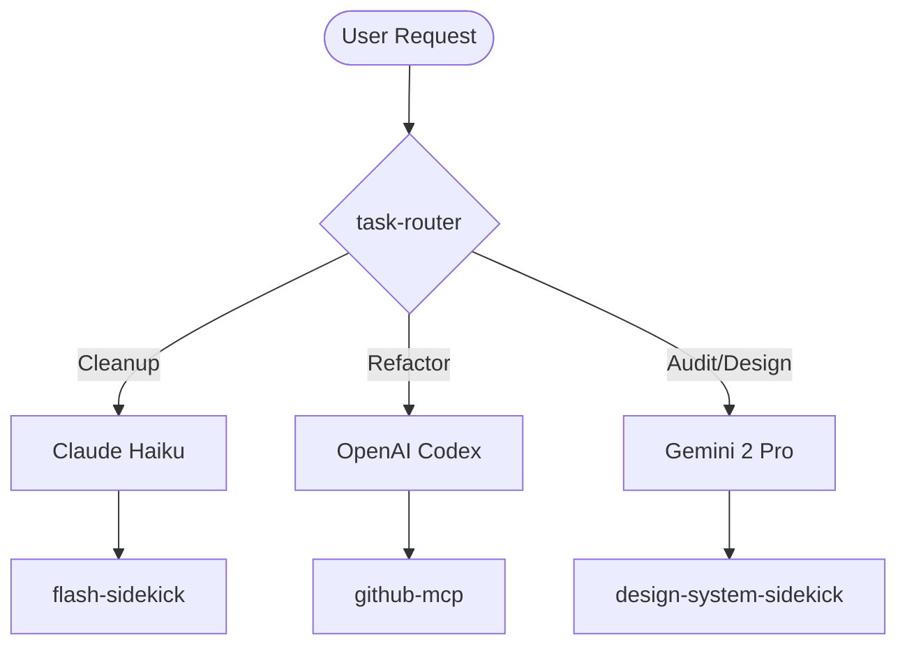

# Agent Model Reference: Deployment Sprint (March 2026)

**Purpose**: Guide the selection and coordination of AI models for the Career Copilot final deployment sprint.

## 1. Model Selection Guidance

| Model | Primary Use Case | Strength | Reasoning Pattern |
|---|---|---|---|
| **Claude Code (Haiku)** | Repo-wide cleanup & pruning | Token efficiency & speed | High-volume file deletion and simple refactors |
| **OpenAI Codex CLI** | Surgical logic refactoring | Python/FastAPI precision | Deep algorithmic fixes and complex dependency migration |
| **Gemini 2 Pro** | Strategic audit & design direction | Multimodal context | KR Solidarity compliance and visual UX appraisal |

### 1.1 Decision Matrix

*   **Task**: Cleanup 50+ unused `.md` files or components.
    *   **Recommendation**: Use **Claude Code (Haiku)**.
*   **Task**: Refactor `backend/app/auth.py` for a new OAuth provider.
    *   **Recommendation**: Use **OpenAI Codex CLI**.
*   **Task**: Audit UI for KR Solidarity v6.1 "Plain UI First" compliance.
    *   **Recommendation**: Use **Gemini 2 Pro** via `design-system-sidekick`.

## 2. Agent Call Graph

## 3. Tool Delegation

| Tool | Agent Affinity | Best Practice |
|---|---|---|
| `flash-sidekick` | Claude Haiku | Batch file reads for speed |
| `design-system-sidekick` | Gemini 2 Pro | Visual compliance checks |
| `github-mcp` | Codex | Precise commit/branch management |

---

**Last Updated**: 2026-03-22
**Status**: Active
**Version**: 2.0.0
