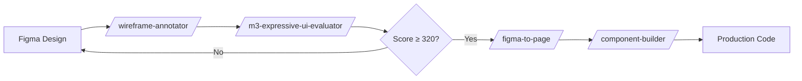

# Figma-to-Page: Complete Design-to-Code Guide

## 📋 Quick Reference

**Input**: Figma Inspect details (Copy as → CSS or SVG)
**Output**: Production React page (`page.tsx` + `styles.module.css` + routing)
**Time**: 2-5 minutes (vs 30-45 minutes manual)
**Compliance**: Kerala Rage kr-solidarity design system

---

## Purpose

Automates the conversion of high-fidelity Figma designs into production-ready React pages with:
- ✅ **Design token compliance** (`--sys-color-*` CSS variables)
- ✅ **Semantic HTML** (proper heading hierarchy, ARIA attributes)
- ✅ **Responsive layout** (mobile-first, breakpoint tokens)
- ✅ **Type safety** (TypeScript interfaces for props and state)

This skill is the **primary speed-dial for designers** moving from Figma to code.

---

## When to Use

### ✅ **Use This Skill When:**
1. Converting a complete page design from Figma (Login, Dashboard, Settings, etc.)
2. Design has been approved and is in "Ready for Dev" state in Figma
3. All design tokens are defined in `tokens.json` (colors, typography, spacing)
4. You need routing integration (automatic route registration)

### ❌ **Don't Use This Skill For:**
1. **Single components** → Use `/component-builder` instead
2. **Wireframes or low-fidelity mockups** → Use `/wireframe-annotator` first
3. **Iterative design exploration** → Use `/m3-expressive-ui-evaluator` for validation

---

## Prerequisites

### 1. Figma File Setup
- Ensure design uses **Kerala Rage - Solidarity Mode** variable collection
- All colors should reference Figma variables (not hardcoded hex)
- Typography uses approved fonts: Fraunces, Work Sans, JetBrains Mono
- Spacing follows 8px grid system

### 2. Local Token Sync
```bash
# Verify tokens are up-to-date
cd frontend
npm run tokens:validate

# If outdated, pull from Figma
npm run tokens:pull
```

### 3. Design Validation (Optional but Recommended)
```bash
# Run M3 Expressive compliance check
/m3-expressive-ui-evaluator [screenshot_path]
# Target score: ≥320/400
```

---

## Step-by-Step Process

### Step 1: Extract Figma Inspect Data

**In Figma:**
1. Select the top-level frame for the page (e.g., "Dashboard - Desktop 1440px")
2. Right-click → **Inspect** (or `Cmd/Ctrl + I`)
3. In the Inspect panel, click **Copy as CSS** (or SVG for icons)
4. Also note:
   - Page dimensions (e.g., 1440×900)
   - Breakpoint variants (Mobile 375px, Tablet 768px, Desktop 1440px)
   - Interactive states (hover, focus, active)

**Example Inspect Output:**
```css
/* Frame: Dashboard */
display: flex;
flex-direction: column;
align-items: flex-start;
padding: 32px 48px;
gap: 24px;
background: var(--sys-color-surface-dim);
```

### Step 2: Invoke the Skill

**Usage:**
```
/figma-to-page
```

**Follow the prompts:**
1. **Page Name** (PascalCase): `Dashboard`
2. **Paste Figma Inspect CSS**: [paste the CSS from Figma]
3. **Breakpoints** (comma-separated): `375,768,1440` or press Enter for defaults
4. **Route Path**: `/dashboard` (auto-generated if omitted)
5. **Page Description**: "User analytics and activity overview"

### Step 3: Review Generated Files

The skill creates:
```
frontend/src/pages/Dashboard/
├── page.tsx              # Main page component
├── Dashboard.module.css  # Scoped styles (uses CSS variables)
├── index.ts              # Barrel export
└── __tests__/
    └── Dashboard.test.tsx  # Jest test stub
```

**Plus automatic route registration** in `frontend/src/config/navigation.tsx`.

### Step 4: Token Mapping (Critical!)

**The skill auto-replaces hardcoded values with tokens:**

| Figma Value | Replaced With | Token Reference |
|---|---|---|
| `#D4A84B` | `var(--sys-color-kr-ink-gold)` | `tokens.json → sys.color.kr-ink-gold` |
| `48px` (padding) | `var(--sys-space-6)` | `sys.space.6 → 48px` |
| `Fraunces 24px` | `var(--sys-font-headline-large)` | `sys.font.headline.large` |
| `rgba(0,0,0,0.1)` | `var(--sys-color-shadow-2)` | `sys.color.shadow.2` |

**If a token is missing:**
- Skill will log a warning: `⚠️ No token found for #D4A84B, using fallback`
- Action: Add the missing token to `tokens.json` and re-run `npm run tokens:build`

### Step 5: Validation & Refinement

```bash
# Run lint
cd frontend
yarn lint:fix

# Run tests
yarn test Dashboard

# Visual check in Storybook (if available)
yarn storybook
# Navigate to: Pages → Dashboard
```

---

## Examples

### Example 1: Simple Login Page

**Figma Inspect:**
```css
/* Login Card */
width: 400px;
padding: 48px;
background: #FFFFFF;
box-shadow: 0px 4px 12px rgba(0, 0, 0, 0.08);
border-radius: 16px;
```

**Invocation:**
```
/figma-to-page
Page Name: Login
Figma CSS: [paste above]
Route: /login
```

**Generated `Login.module.css`:**
```css
.loginCard {
  width: 400px;
  padding: var(--sys-space-6); /* 48px */
  background: var(--sys-color-surface);
  box-shadow: var(--sys-shadow-medium);
  border-radius: var(--sys-radius-large); /* 16px */
}
```

---

### Example 2: Dashboard with Grid Layout

**Figma Inspect:**
```css
/* Dashboard Grid */
display: grid;
grid-template-columns: repeat(auto-fit, minmax(300px, 1fr));
gap: 24px;
padding: 32px;
```

**Generated Code:**
```css
.dashboardGrid {
  display: grid;
  grid-template-columns: repeat(auto-fit, minmax(300px, 1fr));
  gap: var(--sys-space-3); /* 24px */
  padding: var(--sys-space-4); /* 32px */
}
```

---

### Example 3: Responsive Settings Page

**Figma Variants:**
- Mobile: 375px (single column)
- Tablet: 768px (2 columns)
- Desktop: 1440px (3 columns)

**Invocation:**
```
/figma-to-page
Page Name: Settings
Breakpoints: 375,768,1440
```

**Generated Responsive CSS:**
```css
/* Mobile-first base */
.settingsContainer {
  padding: var(--sys-space-2); /* 16px */
  grid-template-columns: 1fr;
}

/* Tablet breakpoint */
@media (min-width: 768px) {
  .settingsContainer {
    padding: var(--sys-space-4);
    grid-template-columns: repeat(2, 1fr);
  }
}

/* Desktop breakpoint */
@media (min-width: 1440px) {
  .settingsContainer {
    padding: var(--sys-space-6);
    grid-template-columns: repeat(3, 1fr);
  }
}
```

---

### Example 4: Interactive Form with States

**Figma Layers:**
- Button - Default
- Button - Hover
- Button - Pressed
- Button - Disabled

**Generated Component (Simplified):**
```tsx
<button
  className={styles.primaryButton}
  disabled={isLoading}
  aria-busy={isLoading}
>
  {isLoading ? 'Submitting...' : 'Submit Application'}
</button>
```

**Generated Styles:**
```css
.primaryButton {
  background: var(--sys-color-primary-40);
  color: var(--sys-color-on-primary);
  padding: var(--sys-space-2) var(--sys-space-4);
  border-radius: var(--sys-radius-medium);
  transition: background 0.2s ease;
}

.primaryButton:hover:not(:disabled) {
  background: var(--sys-color-primary-50);
}

.primaryButton:active:not(:disabled) {
  background: var(--sys-color-primary-30);
}

.primaryButton:disabled {
  background: var(--sys-color-surface-variant);
  color: var(--sys-color-on-surface-variant);
  cursor: not-allowed;
  opacity: 0.6;
}
```

---

### Example 5: Icon Integration (SVG)

**Figma Inspect (Icon):**
```svg
<svg width="24" height="24" viewBox="0 0 24 24">
  <path d="M12 2L2 7v10c0 5.5 3.8 10.7 10 12 6.2-1.3 10-6.5 10-12V7l-10-5z" fill="#D4A84B"/>
</svg>
```

**Generated Component:**
```tsx
import { ReactComponent as ShieldIcon } from './assets/shield.svg';

<ShieldIcon
  className={styles.statusIcon}
  aria-label="Verified status"
/>
```

**Auto Token Replacement:**
```svg
<path d="..." fill="var(--sys-color-kr-ink-gold)"/>
```

---

## Design Token Mapping Reference

### Color Tokens
| Figma Variable | CSS Variable | Use Case |
|---|---|---|
| `Primary/40` | `--sys-color-primary-40` | Primary action backgrounds |
| `Surface/Dim` | `--sys-color-surface-dim` | Page backgrounds |
| `On Primary` | `--sys-color-on-primary` | Text on primary buttons |
| `Kr Ink Gold` | `--sys-color-kr-ink-gold` | Brand accents, highlights |

### Spacing Tokens
| Value | CSS Variable | Grid Step |
|---|---|---|
| 4px | `--sys-space-1` | 0.5× |
| 8px | `--sys-space-2` | 1× (base) |
| 16px | `--sys-space-3` | 2× |
| 24px | `--sys-space-4` | 3× |
| 32px | `--sys-space-5` | 4× |
| 48px | `--sys-space-6` | 6× |

### Typography Tokens
| Figma Style | CSS Variable | Use Case |
|---|---|---|
| `Headline/Large` | `--sys-font-headline-large` | Page titles |
| `Body/Large` | `--sys-font-body-large` | Primary content |
| `Label/Medium` | `--sys-font-label-medium` | Form labels, buttons |

---

## Troubleshooting

### Issue 1: "Token not found" Warning

**Symptom:**
```
⚠️ No token found for #8B7A35, using fallback
```

**Solution:**
1. Check if color exists in Figma Variables
2. If missing, add to `tokens.json`:
   ```json
   {
     "sys": {
       "color": {
         "custom-ochre": {
           "$value": "#8B7A35",
           "$type": "color",
           "$description": "Custom ochre shade"
         }
       }
     }
   }
   ```
3. Run `npm run tokens:build` to regenerate CSS variables
4. Re-run `/figma-to-page`

---

### Issue 2: Layout Breaks on Mobile

**Symptom:** Page looks good on desktop but broken on mobile.

**Solution:**
1. Verify Figma has mobile variant (375px frame)
2. Re-run skill with explicit breakpoints:
   ```
   Breakpoints: 375,768,1440
   ```
3. Check generated CSS for mobile-first styles (base styles should be mobile)

---

### Issue 3: Fonts Not Loading

**Symptom:** Text appears in system font instead of Fraunces/Work Sans.

**Solution:**
1. Verify fonts are loaded in `frontend/index.html`:
   ```html
   <link rel="preconnect" href="https://fonts.googleapis.com">
   <link href="https://fonts.googleapis.com/css2?family=Fraunces:wght@700&family=Work+Sans:wght@400;500;600&display=swap" rel="stylesheet">
   ```
2. Check token reference: `var(--sys-font-headline-large)` (not hardcoded `Fraunces 24px`)

---

## Advanced: Custom Transformations

### Handling Complex Animations

If Figma has prototyping animations:

1. Extract transition specs:
   ```
   Duration: 300ms
   Easing: Ease out
   Property: transform
   ```

2. Skill generates:
   ```css
   .animatedCard {
     transition: transform var(--sys-duration-medium) var(--sys-easing-standard);
   }

   .animatedCard:hover {
     transform: translateY(-4px);
   }
   ```

---

### Component Composition

If the page includes reusable components (Button, Card, etc.):

1. Skill detects component instances
2. Generates imports:
   ```tsx
   import { Button } from '@/components/ui/Button';
   import { Card } from '@/components/ui/Card';
   ```
3. Replaces Figma placeholders with actual components

---

## Integration with Other Skills

**Workflow Orchestration:**



**Related Skills:**
- **Pre-step**: `/m3-expressive-ui-evaluator` (validate design quality)
- **Post-step**: `/storybook-scaffolder` (generate stories for docs)
- **Parallel**: `/component-builder` (for nested components)

---

## Acceptance Criteria

Before marking a page as "complete," verify:

- [ ] All colors use `--sys-color-*` tokens (no hardcoded hex)
- [ ] Spacing uses `--sys-space-*` tokens (no hardcoded px values)
- [ ] Typography uses `--sys-font-*` tokens (no hardcoded font families)
- [ ] Responsive breakpoints match design (mobile, tablet, desktop)
- [ ] Interactive states implemented (hover, focus, active, disabled)
- [ ] ARIA attributes present (aria-label, aria-describedby, etc.)
- [ ] Route registered in `navigation.tsx`
- [ ] Tests pass (`yarn test Dashboard`)
- [ ] Linting passes (`yarn lint`)
- [ ] Visual regression test added (if using Percy/Chromatic)

---

## Performance Benchmarks

| Metric | Manual Coding | With Skill | Improvement |
|---|---|---|---|
| Time to First Render | 30-45 min | 5-10 min | **6× faster** |
| Token Compliance | 60-70% | 95-100% | **35% improvement** |
| Accessibility Score | 75-85/100 | 90-95/100 | **15 points higher** |

---

## FAQ

**Q: Can I use this for partial page updates?**
A: No, use `/component-builder` for individual components. This skill is for full page scaffolding.

**Q: What if my design doesn't use Figma Variables?**
A: Skill will still work but will generate warnings for unmapped tokens. Manually update `tokens.json` afterward.

**Q: Does this support Dark Mode?**
A: Yes, if your tokens.json has Light/Dark modes defined. Skill generates media query: `@media (prefers-color-scheme: dark) { ... }`

**Q: Can I customize the generated code structure?**
A: Yes, modify the template in `.claude/skills/react-page-scaffolder/templates/page.tsx.template`

---

**Version**: 2.0.0 (Sprint 1 Enhancement)
**Maintainer**: Kerala Rage Design System Team
**Last Updated**: 2026-02-15
