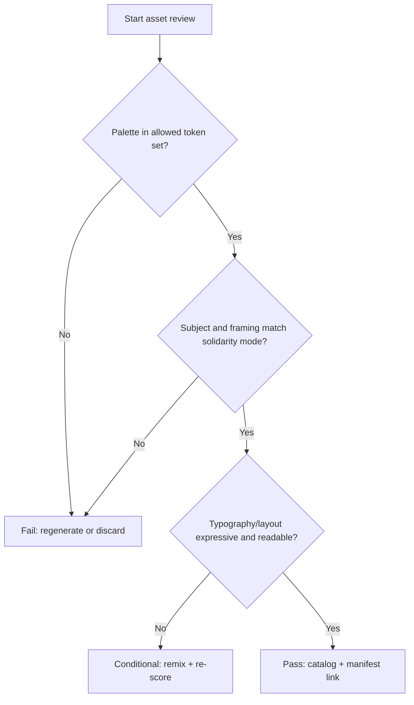

# Mode Compliance: Kerala Rage Solidarity

**Status**: Active and required. This is the only supported mode for this skill.
**Last Updated**: 2026-02-26

## Linked Artifacts

- Inventory: [asset-inventory.md](./asset-inventory.md)
- Gap reference: [doc008-gaps.md](./doc008-gaps.md)
- Canonical manifest: [`frontend/public/assets/kerala-rage-kr-solidarity-manifest.json`](../../../../frontend/public/assets/kerala-rage-kr-solidarity-manifest.json)

## Compliance Matrix

| Dimension | Required | Reject |
|---|---|---|
| Theme | Contemporary Australian, solidarity-forward | Clinical/lab, colonial nostalgia, generic cyberpunk |
| Palette | Semantic tokens only (`--sys-color-*`) mapped to solidarity palette roles (surface, on-surface, primary/accent, structural neutrals, growth accent) | Hardcoded off-system hex values, clinical blue/steel palettes |
| Typography | Fraunces (heading), Work Sans (body), Caveat (accent) | Inter, Roboto, Arial |
| Composition | Bold contrast, expressive asymmetry, readable focal hierarchy | Flat template layouts, decorative clutter, unclear hierarchy |
| Subject Framing | Living endemic species and social context | Museum-cabinet framing, archival nostalgia |

## Triage Decision Table

| Signal | Decision | Action |
|---|---|---|
| Warm earthy palette + endemic motif + clear hierarchy | Compliant | Keep and catalog |
| Mixed signals (good subject, weak palette or hierarchy) | Conditional | Remix and re-score |
| Clinical/technical visual language or off-mode styling | Non-compliant | Discard or regenerate |

## Example Triage JSON

```json
{
  "asset_id": "KR-SOLID-011",
  "legacy_alias": "ASSET-11",
  "mode": "kerala-rage-solidarity",
  "compliance": "PASS",
  "score": 94,
  "reasons": [
    "Uses in-palette warm neutrals",
    "Maintains expressive focal hierarchy",
    "Avoids prohibited legacy aesthetics"
  ],
  "next_action": "catalog"
}
```

## Mode-Compliance Flowchart



## Prompt Template

```text
You are validating a Kerala Rage asset for mode compliance.

Asset: {{asset_name}}
Category: {{category}}
Current ID: {{asset_id}}
Manifest Path: frontend/public/assets/kerala-rage-kr-solidarity-manifest.json

Evaluate strictly against these rules:
1) Palette must use semantic token references only (`--sys-color-*`), aligned to the approved solidarity roles.
2) Visual direction must be contemporary Australian, solidarity-forward, and non-clinical.
3) Typography and composition must be expressive and readable (no generic defaults).
4) Reject colonial nostalgia, museum framing, and technical-lab motif language.

Return JSON:
{
  "asset_id": "...",
  "compliance": "PASS|CONDITIONAL|FAIL",
  "score": 0-100,
  "issues": ["..."],
  "recommended_action": "catalog|remix|regenerate|discard"
}
```

## Validation Checklist

- [ ] Linked manifest path resolves and asset ID exists.
- [ ] Palette is within approved solidarity tokens.
- [ ] No prohibited visual language (clinical, nostalgic museum framing, generic tech).
- [ ] Composition preserves clear focal hierarchy and readability.
- [ ] Typography follows the approved stack (Fraunces, Work Sans, Caveat).
- [ ] Final decision recorded as `PASS`, `CONDITIONAL`, or `FAIL` with reasons.
