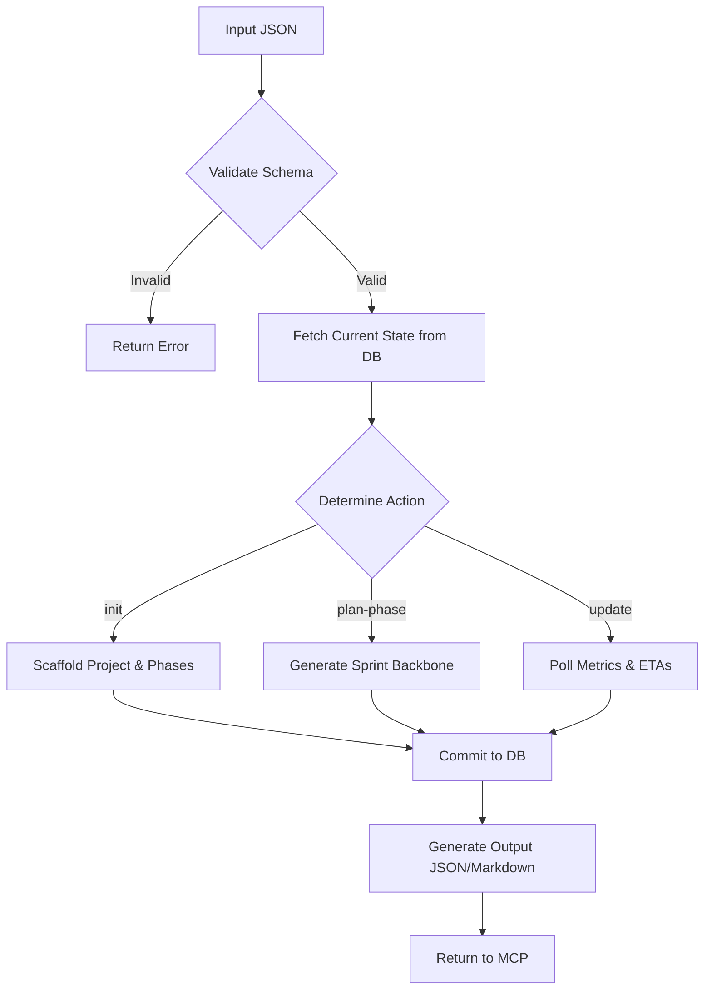

# Workflow Execution Model - Project Manager

This document defines the technical execution model for the `project-manager` skill, transforming it from a conceptual prompt to an operational Python Agent.

## Execution Model

### Invocation Method
The `project-manager` functions as an **orchestration layer** invoked within the current session.

- **Entry Point**: Invoked by the controller agent reading the current project plan.
- **Communication Protocol**: Receives and returns structured JSON or Markdown via the **task-router-mcp** or directly within the session.
- **State Persistence**: Tracks state via plan files and task lists in the project directory.

### Execution Flow

## Phase Lifecycle State Machine

The `project-manager` tracks phases through the following states:

1.  **UNINITIALIZED**: Only exists in the initial request.
2.  **PLANNING**: Project created, but gates for the current phase are not yet met.
3.  **IN_PROGRESS**: Phase active, sprints are being executed by the `sprint-coordinator`.
4.  **BLOCKED**: A critical blocker has been identified; execution is paused until resolution or mitigation.
5.  **AT_GATE**: Phase work technically complete; waiting for verification/sign-off metrics.
6.  **PHASE_COMPLETE**: All success criteria met; ready to transition to the next phase.
7.  **ARCHIVED**: Project completed or cancelled.

### Transition Logic
- **`transition_to_phase(target_id)`**: Triggered when the current phase reaches `PHASE_COMPLETE` and the next phase's gates are satisfied.
- **`auto_escalate(blocker_id)`**: Triggered when a `CRITICAL` blocker remains `OPEN` beyond its `escalation_timeout_hours`.

### Phase Completion Protocol

When `transition_to_phase(target_id)` is triggered or when a phase reaches `PHASE_COMPLETE`:

1. **Generate Completion Report**:
   - Summarize phase deliverables (milestones completed, gates passed)
   - Report phase metrics (duration, velocity, blocker resolution time)
   - Calculate compliance/quality scores from specialist skills (codebase-orchestrator, compliance-dashboard, audit-agent)

2. **Recommend Next Actions**:
   - If next phase exists: Suggest phase kickoff preparation items (2-3 specific tasks with owners)
   - If project complete: Suggest retrospective and archive actions (with timeline)
   - If blockers exist: Escalate and suggest mitigation timeline (owner + ETA)

3. **Set Expectations**:
   - Provide estimated timeline for next phase kickoff (based on team velocity and dependencies)
   - List critical dependencies that must be resolved first
   - Include celebration acknowledgment of team achievement

## Data Architecture

- **Primary Storage**: Plan and task files in the project directory (JSON/Markdown).
- **Audit Log**: Git commit history to verify phase completion gates.
