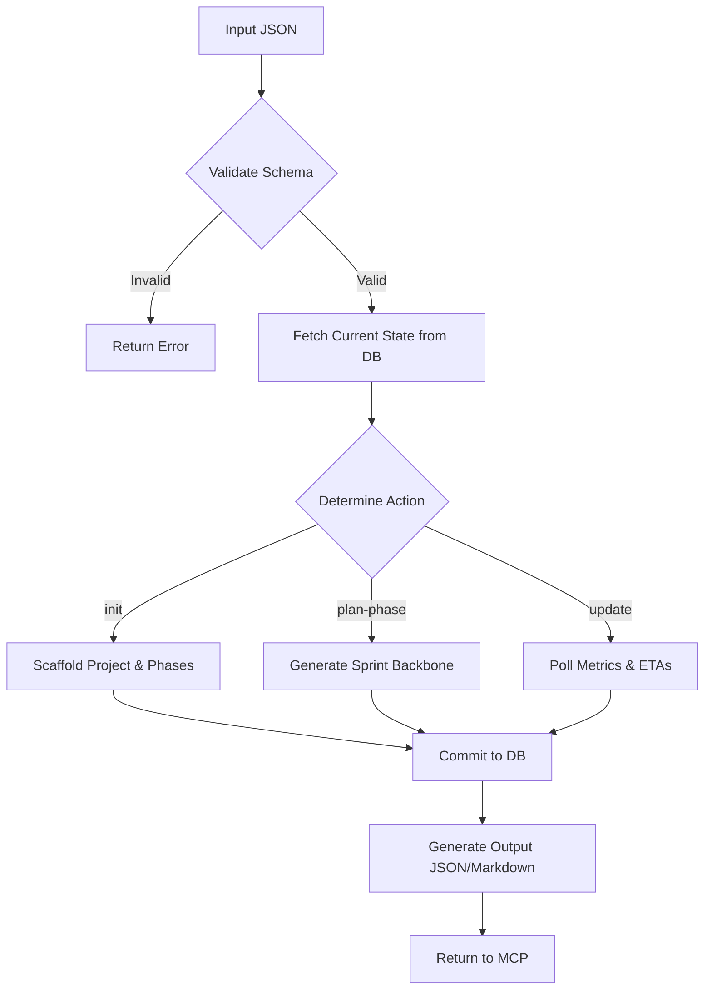

# Workflow Execution Model - Project Manager

This document defines the technical execution model for the `project-manager` skill, transforming it from a conceptual prompt to an operational Python Agent.

## Execution Model

### Invocation Method
The `project-manager` functions as a **Python Agent** integrated into the CareerCopilot backend.

- **Entry Point**: `/backend/app/agents/project_manager_agent.py`
- **Communication Protocol**: Receives and returns JSON via the **task-router-mcp**.
- **State Persistence**: Maintains critical project state in a **PostgreSQL** database (`projects`, `phases`, `milestones` tables).

### Execution Flow

## Phase Lifecycle State Machine

The `project-manager` tracks phases through the following states:

1.  **UNINITIALIZED**: Only exists in the initial request.
2.  **PLANNING**: Project created, but gates for the current phase are not yet met.
3.  **IN_PROGRESS**: Phase active, sprints are being executed by the `sprint-coordinator`.
4.  **BLOCKED**: A critical blocker has been identified; execution is paused until resolution or mitigation.
5.  **AT_GATE**: Phase work technically complete; waiting for verification/sign-off metrics.
6.  **PHASE_COMPLETE**: All success criteria met; ready to transition to the next phase.
7.  **ARCHIVED**: Project completed or cancelled.

### Transition Logic
- **`transition_to_phase(target_id)`**: Triggered when the current phase reaches `PHASE_COMPLETE` and the next phase's gates are satisfied.
- **`auto_escalate(blocker_id)`**: Triggered when a `CRITICAL` blocker remains `OPEN` beyond its `escalation_timeout_hours`.

## Data Architecture

- **Primary Storage**: PostgreSQL (Relational integrity for complex dependency graphs).
- **Caching**: Redis (For high-frequency dashboard queries).
- **Audit Log**: Git (Uses commit history and tags to verify production deployment gates).
