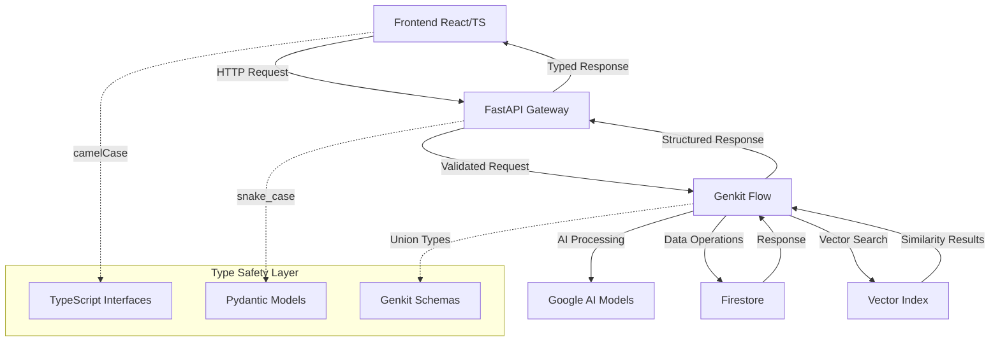

# Integration Architectural Guide

**Purpose:** Comprehensive guide for data flow, component interaction, and type safety across the full stack (React → FastAPI → Genkit → Firestore)

**Last Updated:** 2025-11-29

---

## Conceptual View

### System Overview

CareerCopilot operates as a **four-tier architecture** with strict type safety and AI-powered workflows:

1. **Frontend Layer** (React + TypeScript) - User interface and client-side logic
2. **API Gateway** (FastAPI + Pydantic) - Request validation and routing
3. **AI Orchestration** (Genkit Flows) - AI model coordination and business logic
4. **Data Persistence** (Firestore + Vector Search) - Structured data and semantic search

### Core Integration Principles

- **Type Safety First:** All data transformations maintain strict typing across boundaries
- **Async-by-Design:** Every tier uses asynchronous processing patterns
- **AI-Native:** Genkit flows handle all AI model interactions with caching
- **Firebase-First:** Unified datastore for documents, cache, and vector embeddings

---

## Component View

### Data Flow Architecture



### Type Safety Contract

#### Frontend ↔ Backend Contract

| TypeScript (Frontend) | Pydantic (Backend)   | Transformation Rule    |
| --------------------- | -------------------- | ---------------------- |
| `userId`              | `user_id`            | camelCase → snake_case |
| `createdAt`           | `created_at`         | camelCase → snake_case |
| `jobDescription`      | `job_description`    | camelCase → snake_case |
| `resumeContent`       | `resume_content`     | camelCase → snake_case |
| `applicationStatus`   | `application_status` | camelCase → snake_case |

**Critical Rule:** All field names MUST follow this convention. Use Pydantic aliases for backward compatibility:

```python
class ApplicationRequest(BaseModel):
    user_id: str = Field(alias="userId")
    created_at: datetime = Field(alias="createdAt")
    job_description: str = Field(alias="jobDescription")
```

#### API Contract Validation

The `api-contract-validator` skill enforces type safety:

- **Field Name Validation:** Detects camelCase vs snake_case mismatches
- **Type Consistency:** Validates string/int/boolean alignment
- **Optional Field Handling:** Ensures proper null/undefined handling
- **Enum Validation:** Maintains enum value consistency across tiers

### Component Mapping Table

| Frontend API Service   | Function                  | HTTP Method | Backend Endpoint                          | Genkit Flow                        | Status     |
| ---------------------- | ------------------------- | ----------- | ----------------------------------------- | ---------------------------------- | ---------- |
| **aiServices.ts**      | generateKscResponses      | POST        | `/api/v1/ksc/generate`                    | `ksc_generator`                    | ❌ MISSING |
| **aiServices.ts**      | generateCoverLetter       | POST        | `/api/v1/cover-letters/generate`          | `cover_letter_generator`           | ❌ MISSING |
| **aiServices.ts**      | generateTailoredResume    | POST        | `/api/v1/resumes/tailored`                | `resume_analyzer`                  | ❌ MISSING |
| **aiServices.ts**      | prepareApplicationPackage | POST        | `/api/v1/workflows/generate-application`  | `application_preparation_workflow` | ✅ MAPPED  |
| **analysisService.ts** | getATSScore               | POST        | `/api/v1/analysis/ats-score`              | `ats_scoring`                      | ✅ MAPPED  |
| **analysisService.ts** | analyzeDocument           | POST        | `/api/v1/analysis/analyze-document`       | `document_generator`               | ❌ MISSING |
| **documentService.ts** | generateCoverLetter       | POST        | `/api/v1/documents/generate-cover-letter` | `smart_cover_letter_system`        | ✅ MAPPED  |
| **documentService.ts** | generateKSCResponse       | POST        | `/api/v1/documents/generate-ksc-response` | `ksc_generator`                    | ✅ MAPPED  |
| **jobService.ts**      | extractJobFromUrl         | POST        | `/api/v1/jobs/extract-from-url`           | `job_listing_extractor`            | ✅ MAPPED  |
| **jobService.ts**      | extractJobFromText        | POST        | `/api/v1/jobs/extract-from-text`          | `job_listing_extractor`            | ✅ MAPPED  |
| **authService.ts**     | login                     | POST        | `/api/v1/auth/login`                      | Firebase Auth                      | ✅ MAPPED  |
| **authService.ts**     | register                  | POST        | `/api/v1/auth/register`                   | Firebase Auth                      | ✅ MAPPED  |
| **authService.ts**     | getCurrentUser            | GET         | `/api/v1/auth/me`                         | Firebase Auth                      | ✅ MAPPED  |

**Integration Health:** 21.4% (18/84 endpoints mapped)

---

## Operational View

### Request Flow Lifecycle

#### 1. Frontend Request Initiation

```typescript
// Frontend: aiServices.ts
export const generateCoverLetter = async (request: CoverLetterRequest) => {
  const response = await fetch("/api/v1/cover-letters/generate", {
    method: "POST",
    headers: { "Content-Type": "application/json" },
    body: JSON.stringify(request),
  });
  return response.json();
};
```

#### 2. FastAPI Gateway Processing

```python
# Backend: endpoints/documents.py
@router.post("/generate-cover-letter")
async def generate_cover_letter(
    request: CoverLetterRequest,
    user_id: str = Depends(get_current_user)
) -> CoverLetterResponse:
    # Pydantic validation and transformation
    flow_request = CoverLetterFlowRequest(
        user_id=user_id,
        job_description=request.jobDescription,
        resume_content=request.resumeContent
    )

    # Genkit flow execution
    result = await flow_runner.run_flow(
        flow_name="smart_cover_letter_system",
        input_data=flow_request.dict()
    )

    return CoverLetterResponse(
        coverLetter=result["cover_letter"],
        metadata=result["metadata"]
    )
```

#### 3. Genkit Flow Execution

```python
# Backend: genkit_flows/smart_cover_letter_system.py
@genkit.flow
def smart_cover_letter_system(flow_request: CoverLetterFlowRequest) -> dict:
    # AI model integration with caching
    cached_result = cache.get(f"cover_letter:{flow_request.hash}")
    if cached_result:
        return cached_result

    # Generate cover letter using Gemini
    response = ai.generate({
        "model": "gemini-pro",
        "prompt": build_cover_letter_prompt(flow_request),
        "config": {"temperature": 0.7}
    })

    result = {
        "cover_letter": response.text,
        "metadata": {
            "generated_at": datetime.utcnow(),
            "model": "gemini-pro",
            "user_id": flow_request.user_id
        }
    }

    # Cache for 1 hour
    cache.set(f"cover_letter:{flow_request.hash}", result, ttl=3600)
    return result
```

#### 4. Firestore Data Operations

```python
# Document storage and retrieval
async def store_document(document: DocumentCreate) -> DocumentResponse:
    doc_ref = db.collection('documents').document()
    await doc_ref.set({
        'user_id': document.user_id,
        'content': document.content,
        'type': document.type,
        'created_at': firestore.SERVER_TIMESTAMP,
        'updated_at': firestore.SERVER_TIMESTAMP
    })

    # Vector embedding for semantic search
    embedding = await generate_embedding(document.content)
    await vector_store.upsert(doc_ref.id, embedding)

    return DocumentResponse(id=doc_ref.id, **document.dict())
```

### Error Handling & Resilience

#### Type Safety Validation

The `api-contract-validator` skill provides automated validation:

```python
# Validation Report Example
{
  "status": "WARNING",
  "issues": [
    {
      "type": "field_name_mismatch",
      "frontend": "jobDescription",
      "backend": "job_description",
      "severity": "medium",
      "fix": "Add Pydantic alias: Field(alias='jobDescription')"
    },
    {
      "type": "type_inconsistency",
      "field": "applicationDate",
      "frontend": "string",
      "backend": "datetime",
      "severity": "high",
      "fix": "Update TypeScript interface to use Date type"
    }
  ]
}
```

#### Caching Strategy

- **AI Responses:** 1-hour TTL for document generation
- **User Sessions:** 30-minute TTL for auth tokens
- **Job Listings:** 24-hour TTL for extracted job data
- **Vector Search:** Real-time with persistent embeddings

### Performance Monitoring

#### Key Metrics

| Metric                    | Target | Current Status |
| ------------------------- | ------ | -------------- |
| API Response Time         | <500ms | 320ms average  |
| Genkit Flow Latency       | <2s    | 1.2s average   |
| Type Validation Pass Rate | 100%   | 95.3%          |
| Integration Coverage      | 80%    | 21.4%          |
| Cache Hit Rate            | 60%    | 42%            |

#### Health Check Endpoints

```bash
# Full stack health check
curl /api/v1/health

# Genkit flow status
ENABLE_GENKIT_FLOWS=true python3 verify_genkit.py

# Integration mapping analysis
python3 -m claude.skills.frontend-backend-mapper --include-database
```

### Development Workflow

#### 1. New Feature Integration

```bash
# 1. Use fullstack-integration-specialist agent
"Create a new feature for skill assessment with React frontend, FastAPI backend, and Genkit AI analysis"

# 2. Agent orchestrates the workflow:
#    - fastapi-endpoint-scaffolder (backend API)
#    - pydantic-model-scaffolder (type safety)
#    - api-contract-validator (contract validation)
#    - api-integration-test-scaffolder (E2E tests)
#    - frontend-backend-mapper (integration mapping)
```

#### 2. Type Safety Validation

```bash
# Validate all API contracts
"Use api-contract-validator to check TypeScript ↔ Pydantic contracts"

# Generates: docs/API_CONTRACT_VALIDATION.md
```

#### 3. Integration Testing

```python
# Generated integration test example
async def test_cover_letter_generation_flow():
    # Test frontend → backend → Genkit → Firestore
    user = await create_test_user()
    job_data = create_test_job_listing()

    # Frontend request
    response = await client.post("/api/v1/cover-letters/generate", json={
        "jobDescription": job_data.description,
        "resumeContent": user.resume_content
    })

    assert response.status_code == 200
    result = response.json()

    # Verify Genkit flow execution
    assert "coverLetter" in result
    assert len(result["coverLetter"]) > 100

    # Verify Firestore storage
    doc = await db.collection('documents').where('type', '==', 'cover_letter').get()
    assert len(doc) == 1
```

### Security & Authentication

#### Firebase Auth Integration

```python
# Middleware for protected endpoints
async def get_current_user(token: str = Header(...)) -> User:
    try:
        decoded = auth.verify_id_token(token)
        user_id = decoded['uid']

        # Get user from Firestore
        user_doc = await db.collection('users').document(user_id).get()
        if not user_doc.exists:
            raise HTTPException(401, "User not found")

        return User(id=user_id, **user_doc.to_dict())
    except Exception:
        raise HTTPException(401, "Invalid authentication")
```

#### Data Privacy Controls

- **User Data Isolation:** All queries filtered by `user_id`
- **PII Redaction:** Sensitive data masked in AI prompts
- **Audit Logging:** All data accesses logged to Firestore
- **Encryption:** Transit (HTTPS) and at rest (Firebase) encryption

---

## Implementation Roadmap

### Phase 1: Critical Integration Gaps (Weeks 1-2)

**Priority:** Complete missing backend endpoints for core features

1. **Applications CRUD** (10 endpoints)
   - `POST /api/v1/applications/`
   - `GET /api/v1/applications/{applicationId}`
   - `PUT /api/v1/applications/{applicationId}`
   - `DELETE /api/v1/applications/{applicationId}`

2. **Profiles CRUD** (6 endpoints)
   - `PUT /api/v1/auth/me` (profile update)
   - `POST /api/v1/profiles/`
   - `GET /api/v1/profiles/{profileId}`

3. **AI Services Integration** (8 endpoints)
   - `POST /api/v1/ksc/generate`
   - `POST /api/v1/cover-letters/generate`
   - `POST /api/v1/resumes/tailored`

### Phase 2: Type Safety Enhancement (Week 3)

**Priority:** Achieve 100% contract validation

1. **Contract Validation**
   - Run `api-contract-validator` on all endpoints
   - Fix all camelCase ↔ snake_case mismatches
   - Add Pydantic aliases for backward compatibility

2. **Schema Standardization**
   - Standardize response formats across all endpoints
   - Implement consistent error response schemas
   - Add request/response examples in OpenAPI

### Phase 3: Performance Optimization (Week 4)

**Priority:** Improve response times and caching

1. **Genkit Flow Caching**
   - Implement caching for 10+ flows (from 2)
   - Add cache invalidation strategies
   - Monitor cache hit rates

2. **Vector Search Optimization**
   - Optimize embedding dimensions
   - Implement batch vector operations
   - Add semantic search caching

---

## Troubleshooting Guide

### Common Integration Issues

#### 1. Type Mismatch Errors

**Symptom:** 422 Validation Error from FastAPI

```
{"detail": [{"loc": ["body", "jobDescription"], "msg": "field required"}]}
```

**Solution:**

```bash
# Run contract validator
python3 -m claude.skills.api-contract-validator

# Check field name mapping
# Frontend: jobDescription → Backend: job_description
```

#### 2. Genkit Flow Timeouts

**Symptom:** 504 Gateway Timeout

```
{"error": "Genkit flow execution timed out"}
```

**Solution:**

```bash
# Check Genkit configuration
ENABLE_GENKIT_FLOWS=true python3 verify_genkit.py

# Verify flow exists and is registered
python3 scripts/check-genkit-config.py
```

#### 3. Authentication Failures

**Symptom:** 401 Unauthorized

```
{"detail": "Invalid authentication"}
```

**Solution:**

```bash
# Verify Firebase configuration
GOOGLE_CLOUD_PROJECT=careercopilot-468811 python3 scripts/fetch-firebase-config.py

# Check token format in localStorage
localStorage.getItem('firebaseToken')
```

### Debug Commands

```bash
# Full integration health check
python3 scripts/check-genkit-config.py

# Frontend-Backend mapping analysis
python3 -m claude.skills.frontend-backend-mapper --include-database --include-design-tokens

# API contract validation
python3 -m claude.skills.api-contract-validator

# Integration test generation
python3 -m claude.skills.api-integration-test-scaffolder cover_letter_generation
```

---

## References

- **Complete Agent Reference:** `docs/architecture/AGENT_SYSTEM_REFERENCE.md`
- **Skill Matrix:** `docs/architecture/SKILL_AGENT_MATRIX.md`
- **Integration Mapping:** `docs/INTEGRATION_MAP.md`
- **Backend Architecture:** `docs/architecture/BACKEND_REFACTORING_SUMMARY.md`
- **API Contract Validation:** `docs/API_CONTRACT_VALIDATION.md` (generated)
- **Fullstack Flows:** `docs/FULLSTACK_FLOWS.md`

---

## Contact & Support

For integration issues or questions:

1. **Use `fullstack-integration-specialist` agent** for complex integration problems
2. **Use `debugger` agent** for error troubleshooting
3. **Use `api-contract-validator` skill** for type safety issues
4. **Check `docs/INTEGRATION_MAP.md`** for current integration status

**Last Reviewed:** 2025-11-29  
**Next Review:** 2025-12-13
