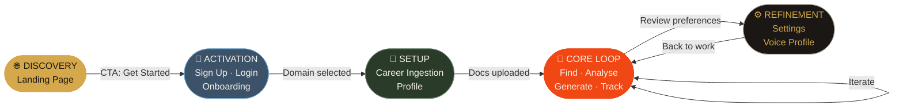
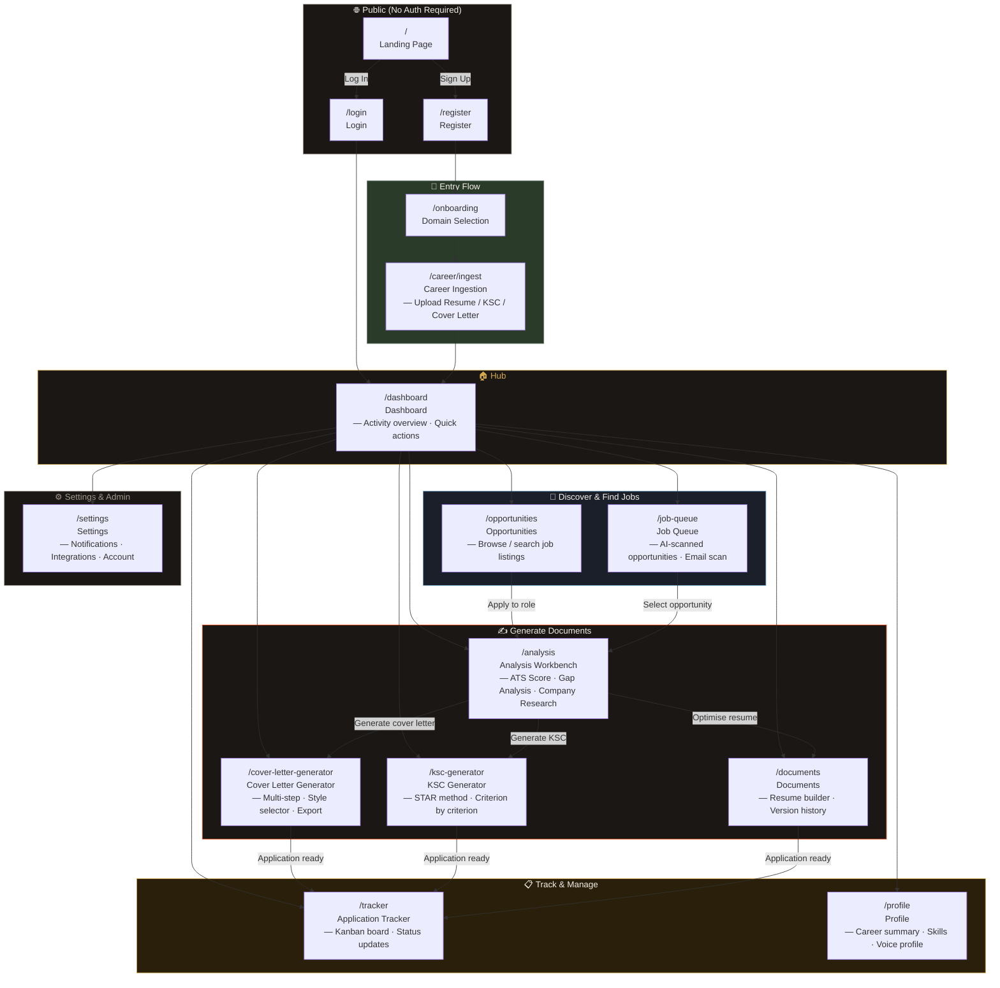
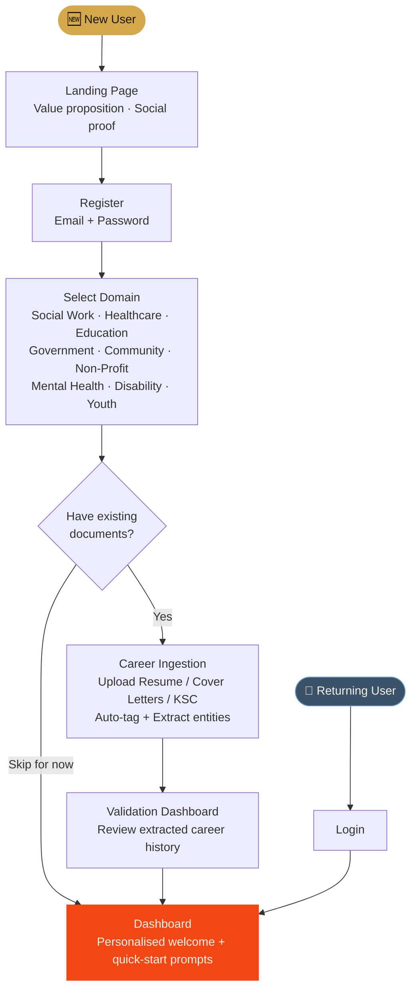
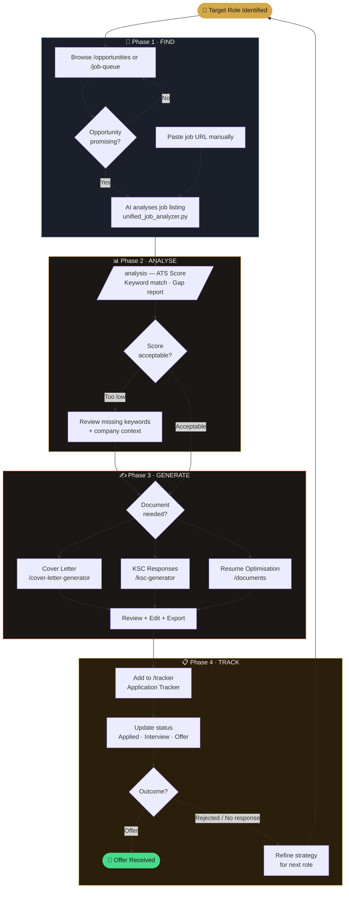
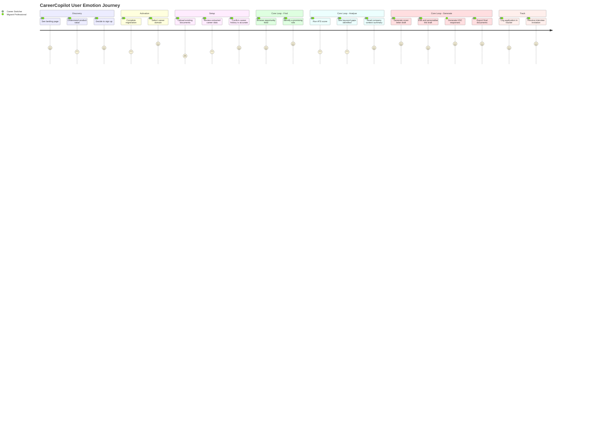

22# CareerCopilot – UX Process Map

> Generated by `scripts/generate_ux_process_map.py`.
> Use this document to organise UX sprints, map user journeys, and identify design priorities.
> Render diagrams with any Mermaid-compatible viewer (GitHub, mermaid.live, VS Code extension).

---

## Target Audience

CareerCopilot serves people moving into or within the **community services sector** in Australia —
specifically migrants, people of colour, career-changers, and re-entrants who face systemic barriers
in a job market not built for them.

### User Personas

| Persona | Description | Key Pain Points | Differentiating Need |
|---|---|---|---|
| **The Career Switcher** | Experienced professional moving from another sector into social work, healthcare, or education | Doesn't know how to translate their existing experience into community-services language | Resume reframing + KSC help |
| **The Migrant Professional** | Trained overseas; navigating Australian job conventions (KSC, selection criteria, APS roles) | Unfamiliar with KSC format, uncertain about cultural tone in applications | KSC generator + company context |
| **The Re-Entrant** | Returning after a career gap (parenting, illness, relocation) | Needs to explain and bridge the gap; low confidence | ATS scoring + gap analysis |
| **The Sector First-Timer** | Recent graduate entering community services directly | Limited work history; needs to frame academic and volunteer experience effectively | Voice profile + AI coaching |

---

## 1. Five-Phase Overview

Every user journey passes through five phases. The core loop (Phase 4) repeats for every job application.



---

## 2. Navigation Architecture

All screens and their transitions. Solid arrows are primary flows; dashed arrows are secondary paths.



---

## 3. Onboarding Flow (First-Time Users)



### Onboarding Steps Detail

| Step | Screen | User Action | System Response | Exit Condition |
|---|---|---|---|---|
| 1 | Landing (`/`) | Reads value proposition, clicks "Get Started" | — | CTA click |
| 2 | Register (`/register`) | Enters email + password (or OAuth) | Firebase account created; JWT issued | Account created |
| 3 | Onboarding (`/onboarding`) | Selects career domain (e.g. Social Work) | Domain stored to profile | Selection confirmed |
| 4 | Career Ingestion (`/career/ingest`) | Uploads resume, cover letter, or KSC documents | AI parses, auto-tags, embeds into VectorStore | ≥1 document processed **or** user skips |
| 5 | Validation Dashboard | Reviews extracted career history | Highlights missing or ambiguous data | User confirms |
| 6 | Dashboard (`/dashboard`) | Sees personalised welcome and quick-start prompts | Dashboard loads with contextual CTAs | — |

---

## 4. Core Application Loop

This loop repeats for every job the user applies for.



### Loop Step Detail

| Phase | Screen | User Goal | Key Input | AI/System Output |
|---|---|---|---|---|
| **Find** | `/opportunities`, `/job-queue` | Identify a relevant role | Browse feed or paste URL | Structured job brief (role, requirements, company) |
| **Analyse** | `/analysis` | Know how well they match | Resume + job description | ATS score, keyword gap, company context |
| **Generate** | `/cover-letter-generator`, `/ksc-generator`, `/documents` | Create tailored application materials | Job brief + resume context | Draft cover letter / KSC responses / optimised resume |
| **Review** | Same generators | Personalise the AI output | In-page edit | Edited document ready for export |
| **Track** | `/tracker` | Record the application | Application details | Kanban card with status |

---

## 5. User Emotion Journey

Emotional register at each stage. Higher score = more positive / confident feeling.



**Key insight**: Emotion dips during Setup (uploading documents is tedious) and during Analysis
(seeing keyword gaps can feel discouraging). These are the two highest-risk drop-off points.
Design should acknowledge effort and reframe gaps as *actionable*, not critical.

---

## 6. Screen Inventory

| # | Route | Screen Name | Emotional Register | Status | Primary User Goal |
|---|---|---|---|---|---|
| 01 | `/` | Landing | **Defiance** | ✅ Live | Understand value and sign up |
| 02 | `/login` · `/register` | Auth | **Trust** | ✅ Live | Authenticate securely |
| 03 | `/onboarding` | Onboarding | **Possibility** | ✅ Live | Set career domain and context |
| 04 | `/career/ingest` | Career Ingestion | **Gravity** | ✅ Live | Upload and extract career history |
| 05 | `/dashboard` | Dashboard | **Altitude** | ✅ Live | Overview of activity and quick-start actions |
| 06 | `/opportunities` | Opportunities / Lookout | **Discovery** | 🔧 In progress | Browse and filter job listings |
| 07 | `/job-queue` | Job Queue | **Discovery** | 🔧 In progress | Review AI-surfaced opportunities from email / search |
| 08 | `/analysis` | Analysis Workbench | **Revelation** | ✅ Live | ATS score, gap analysis, company research |
| 09 | `/cover-letter-generator` | Cover Letter Generator | **Craft** | ✅ Live | Draft a tailored cover letter |
| 10 | `/ksc-generator` | KSC Generator | **Craft** | ✅ Live | Write STAR-format KSC responses |
| 11 | `/documents` | Documents / Workbench | **Craft** | ✅ Live | Build and manage resume versions |
| 12 | `/tracker` | Application Tracker | **Control** | ✅ Live | Track application statuses on a Kanban board |
| 13 | `/profile` | Profile | **Refinement** | ✅ Live | Manage career summary, skills, and voice profile |
| 14 | `/settings` | Settings | **Archive Vault** | ✅ Live | Notifications, integrations, account preferences |

---

## 7. User Story Map

Maps user goals to the screens and API calls that fulfill them, organised by journey phase.

| Phase | Persona | "I want to…" | Screen(s) | API / Flow |
|---|---|---|---|---|
| Discovery | All | Understand what CareerCopilot does and who it's for | `/` | — |
| Activation | All | Create an account and tell the app my career focus | `/register` → `/onboarding` | Firebase Auth |
| Setup | All | Load my existing career documents so the AI has context | `/career/ingest` | `POST /api/ingest/artifacts/upload` |
| Setup | Migrant Professional | See that my overseas experience is understood and correctly labelled | `/career/ingest` (Validation Dashboard) | `POST /api/smart-ingestion/upload-and-tag` |
| Find | All | Browse job listings relevant to my domain and location | `/opportunities` | `POST /api/v1/job-scout/search` |
| Find | All | Have the app automatically surface relevant jobs from my email | `/job-queue` | `POST /api/workflows/scan-email-opportunities` |
| Find | All | Paste a job URL and get an instant structured summary | `/analysis` | `POST /api/genkit/job/analyze-url` |
| Analyse | All | Know how well my resume matches this specific job's requirements | `/analysis` | `POST /api/resume-audit/evaluate` |
| Analyse | All | See exactly which keywords I'm missing from the job description | `/analysis` | `POST /api/analysis/optimize-resume` |
| Analyse | Migrant Professional | Understand what the employer's culture and values are | `/analysis` | `POST /api/genkit/company/context` |
| Generate | All | Get a first draft of my cover letter tailored to this role | `/cover-letter-generator` | `POST /api/genkit/cover-letter/generate` |
| Generate | Migrant Professional / Re-Entrant | Get step-by-step help writing Key Selection Criteria responses | `/ksc-generator` | `POST /api/genkit/ksc/generate` |
| Generate | All | Optimise my resume for this specific role | `/documents` | `POST /api/genkit/resume/optimize` |
| Generate | All | Export my final documents as PDF | `/cover-letter-generator` · `/documents` | Export Engine |
| Track | All | Record where I am in the application process for each job | `/tracker` | `POST /api/applications` |
| Track | All | Update the status when I hear back from the employer | `/tracker` | Kanban board |
| Refine | All | Teach the app my writing voice so outputs sound like me | `/settings` · `/profile` | Voice Profile (AI) |
| Refine | All | See my overall job search progress and activity over time | `/dashboard` | Dashboard metrics |

---

## UX Priorities & Open Issues

### 🔴 Critical
| ID | Issue | Affected Screen(s) | Suggested Fix |
|---|---|---|---|
| UX-01 | No clear progress indicator during multi-step generation flows | Cover Letter Generator, KSC Generator | Add a step counter (Step 2 of 3) and estimated time label |
| UX-02 | New users hit the Dashboard with no contextual guidance if they skip ingestion | `/dashboard` | Add a dismissible "Getting Started" checklist (upload docs → find a role → generate) |
| UX-03 | "KSC Generator" label is opaque to users unfamiliar with Australian government applications | Navigation, `/ksc-generator` | Relabel as "Key Selection Criteria (KSC) — Government Applications" with a tooltip |
| UX-04 | No empty state on the Opportunities and Job Queue screens when no jobs have been fetched yet | `/opportunities`, `/job-queue` | Add an illustrated empty state with a prompt to trigger a job search or email scan |

### 🟡 High
| ID | Issue | Affected Screen(s) | Suggested Fix |
|---|---|---|---|
| UX-05 | Career Ingestion and Analysis are separate routes but share a tight data dependency | `/career/ingest`, `/analysis` | Surface a "Your Documents" summary widget on the Analysis page so users know what context the AI has |
| UX-06 | No indication whether a generated document used the user's uploaded career history or not | `/cover-letter-generator`, `/ksc-generator` | Add a "Context used: 3 documents" badge on generation outputs |
| UX-07 | Application Tracker has no link back to the source documents (resume, cover letter) used for that application | `/tracker` | Attach generated document references to each tracked application card |
| UX-08 | Settings page has no visibility into connected integrations (Gmail scan, job scout) | `/settings` | Add an "Integrations" section showing connection status + last scan time |

### 🟢 Enhancement
| ID | Issue | Affected Screen(s) | Suggested Fix |
|---|---|---|---|
| UX-09 | No dashboard summary of ATS scores across recent applications | `/dashboard` | Add a mini score-trend chart (last 5 applications) |
| UX-10 | Mobile navigation not optimised for core loop actions | All | Prioritise "Find", "Generate", and "Track" in the bottom nav on mobile |
| UX-11 | Users cannot easily restart a generation with different tone/style parameters | `/cover-letter-generator` | Add a "Regenerate with different style" quick action below the output |
| UX-12 | No social proof / success stories on the landing page for the target demographic | `/` | Add 2–3 short testimonials from community services / government job applicants |

---

```markdown
## Open UX Design Questions & Proposed Directions

1.  **Onboarding depth**:
    *   **Proposed Direction**: Maintain the optional flow to minimize initial friction and drop-off. Instead of a mandatory block, implement a "Getting Started" checklist on the Dashboard that incentivizes document uploads with clear benefit callouts (e.g., "Upload your resume to unlock ATS scoring").

2.  **KSC visibility**:
    *   **Proposed Direction**: Surface contextually. When the system detects a government-related job posting (via keywords or domain), trigger a "Government Application detected: Generate KSC responses" call-to-action within the Job Analysis view.

3.  **Voice profile**:
    *   **Proposed Direction**: Keep the detailed configuration in Settings to avoid overwhelming new users. However, introduce a "Teach the AI your voice" prompt immediately after a user's first successful document generation to capture style preferences while the value proposition is fresh.

4.  **Opportunity discovery vs manual entry**:
    *   **Proposed Direction**: Treat both as primary. The Dashboard should feature a prominent "Paste Job URL" quick-action for users with a specific target, while the "Discovery" tab serves users browsing for new opportunities. Data shows power users often start with a URL.

5.  **Tracker–Generator link**:
    *   **Proposed Direction**: Implement a dedicated "Application Detail" view. This provides a unified workspace for each application, housing the job description, resume version, cover letter, and tracking status in one place, rather than scattering them across different generator routes.
```
