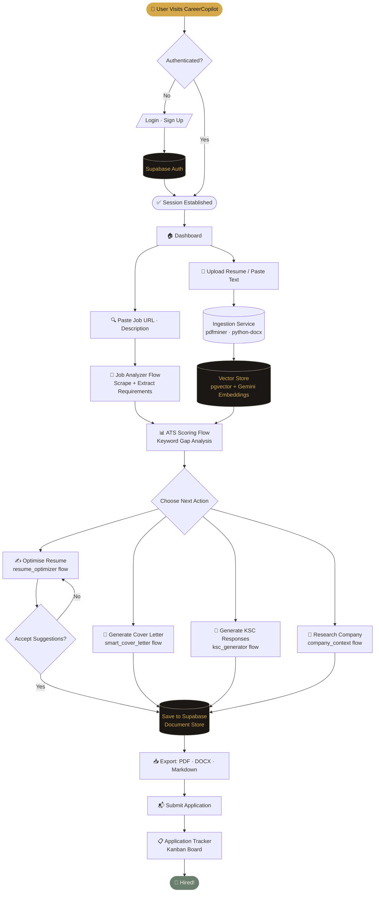
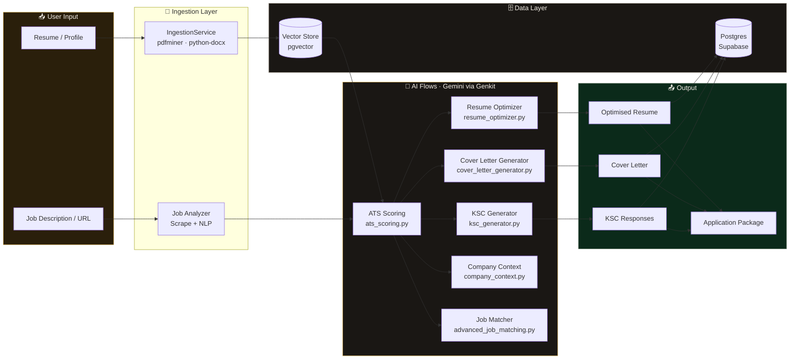
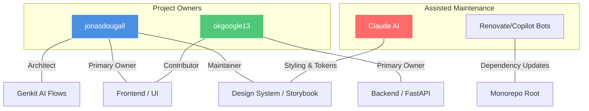

# CareerCopilot – Workflow Diagrams

> Generated by `scripts/generate_workflow_diagram.py`.
> Render with any Mermaid-compatible viewer (GitHub, mermaid.live, VS Code extension).

---

## 1. User Journey

End-to-end flow from landing on the app through to submitting a job application.



---

## 2. AI Flow Architecture

How the Genkit AI flows connect inputs, vector storage, and generated outputs.



---

## 3. Ownership Workflow Map
This map illustrates the "Ownership" of various modules based on Git history and contribution volume. `jonasdougall` appears as the primary architect and frontend owner, while `okgoogle13` maintains a heavy focus on the backend and core business logic.



---

## 4. Module Dependency Workflow
This workflow diagrams how data and dependencies flow between the internal packages. The architecture follows a token-driven design system and a decoupled service pattern.

```mermaid
flowchart LR
    subgraph Design_Layer [Design & Tokens]
        DS[Design System] -->|Tokens/Styles| FE
    end

    subgraph Application_Layer [Client & Edge]
        FE[React Frontend] <-->|API Calls| BE
        FE <-->|Cloud Events| FN[Firebase Functions]
        UI[@careercopilot/ui] -->|Component Library| FE
    end

    subgraph Service_Layer [Business Logic & AI]
        BE[Python Backend] -->|Vertex AI| GEN[Genkit Flows]
        BE -->|Alembic| DB[(PostgreSQL Database)]
        FN -->|Triggers| DB
    end

    %% Deployment & Sync
    ROOT[Root Scripts] -->|Sync| DS
    ROOT -->|Orchestrate| BE
    ROOT -->|Deploy| FN

    style FE fill:#61dafb,stroke:#333
    style BE fill:#ffd43b,stroke:#333
    style GEN fill:#f39c12,stroke:#333,color:#fff
    style DS fill:#6c5ce7,stroke:#fff,color:#fff
```

---

## Key Components

| Component | File | Responsibility |
|---|---|---|
| Ingestion Service | `backend/app/services/ingestion_service.py` | Parse PDF/DOCX resumes |
| Job Analyzer | `ai/flows/backend/job_analyzer.py` | Scrape & extract job requirements |
| ATS Scoring | `ai/flows/backend/ats_scoring.py` | Score resume against job description |
| Resume Optimizer | `ai/flows/backend/resume_optimizer.py` | Suggest keyword improvements |
| Cover Letter Generator | `ai/flows/backend/cover_letter_generator.py` | Draft tailored cover letters |
| KSC Generator | `ai/flows/backend/ksc_generator.py` | Draft STAR-format KSC responses |
| Company Context | `ai/flows/backend/company_context.py` | Research company background |
| Vector Store | `backend/app/services/vector_store.py` | Semantic search (pgvector) |
| Application Tracker | `frontend/src/features/applications/` | Kanban board for job tracking |
