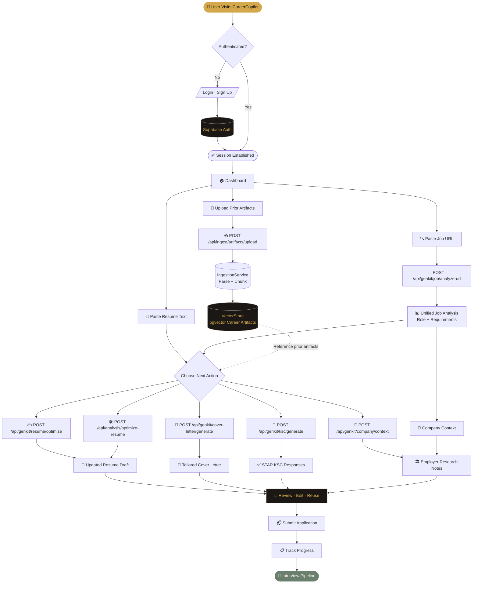
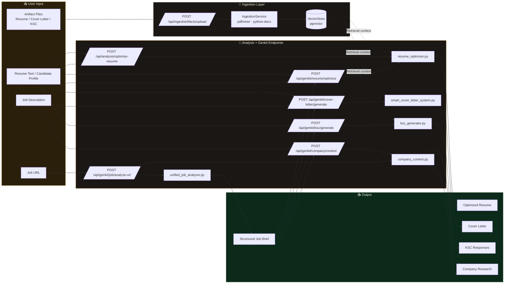

# CareerCopilot – Workflow Diagrams

> Generated by `scripts/generate_workflow_diagram.py`.
> Render with any Mermaid-compatible viewer (GitHub, mermaid.live, VS Code extension).

---

## 1. User Journey

Modular user journey for artifact ingestion, job analysis, and targeted drafting flows.

---

## 2. AI Flow Architecture

How the live API endpoints connect ingestion, Genkit flows, and generated outputs.

---

## Key Components

| Component | File | Responsibility |
|---|---|---|
| Ingestion API | `backend/app/api/endpoints/ingest.py` | Upload career artifacts for parsing |
| Ingestion Service | `backend/app/services/ingestion.py` | Parse PDF/DOCX/TXT and chunk content |
| Genkit API | `backend/app/api/endpoints/genkit.py` | Expose modular AI drafting endpoints |
| Analysis API | `backend/app/api/endpoints/analysis.py` | Resume optimization endpoint |
| Job Analyzer | `backend/app/genkit_flows/unified_job_analyzer.py` | Extract structured job details from URLs |
| Resume Optimizer | `backend/app/genkit_flows/resume_optimizer.py` | Refine resume content against job context |
| Smart Cover Letter | `backend/app/genkit_flows/smart_cover_letter_system.py` | Draft tailored cover letters |
| KSC Generator | `backend/app/genkit_flows/ksc_generator.py` | Draft STAR-format KSC responses |
| Company Context | `backend/app/genkit_flows/company_context.py` | Generate employer research context |
| Vector Store | `backend/app/services/vector_store.py` | Store and retrieve prior career artifacts |
| Cover Letter UI | `frontend/src/features/applications/CoverLetterGenerator.tsx` | Compose job analysis + letter generation |
