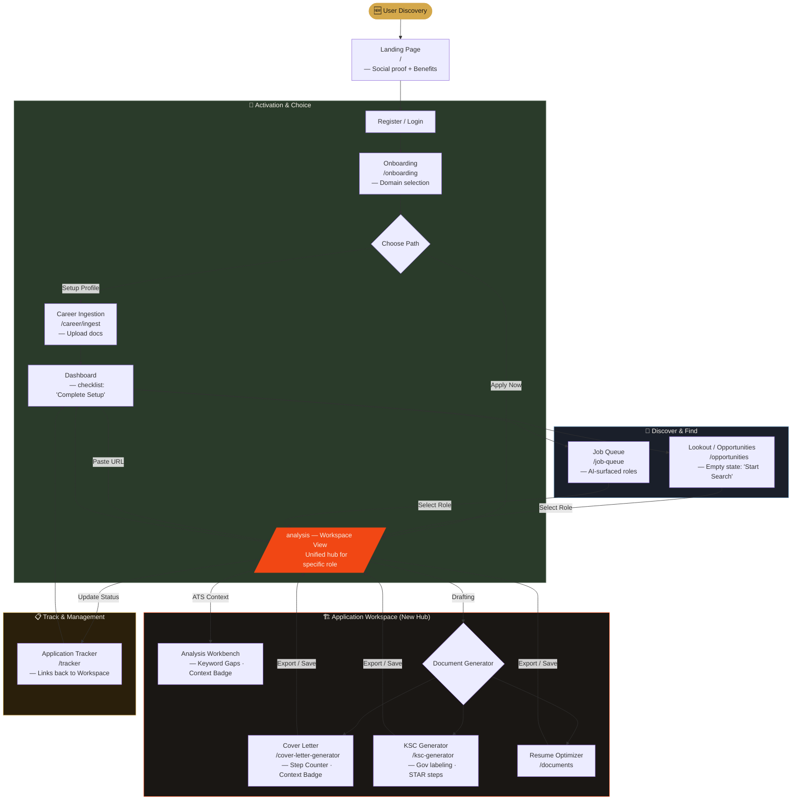

# CareerCopilot: Refined User Workflow (v6.1)

This diagram reflects the fixes for UX issues UX-01 through UX-12, introducing the **Application Workspace** as a central hub for individual job pursuits.

### Key Journey Improvements:
1.  **Unified Workspace**: `/analysis` now acts as the focus point for a specific job, linking all generated assets and tracking status.
2.  **Contextual Awareness**: Indicators on generator pages show exactly which documents informed the AI output.
3.  **Active Guidance**: The Dashboard now features a "Getting Started" checklist to prevent "empty hub" paralysis.
4.  **Clarity**: KSC is explicitly labeled as a Government Application tool.
