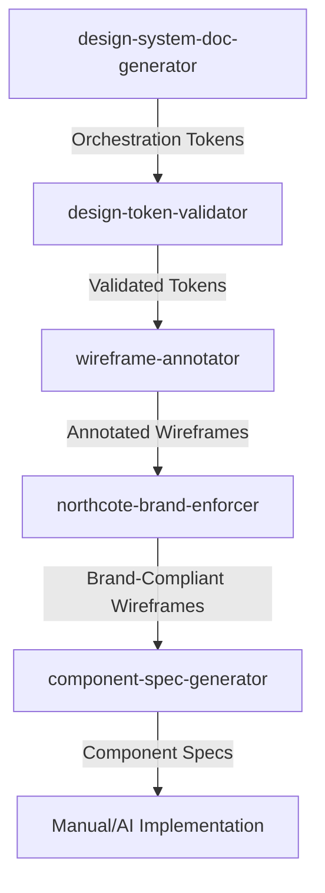

# Design-to-Code Workflow

This document outlines the standard pipeline for transforming design intent from research and mood boards into production-ready React component specifications using the CareerCopilot design system skills.

## Overview

The workflow ensures that every component is compliant with the **Northcote Curio** (Victorian Naturalist) or **M3 Expressive** aesthetic standards, and is fully documented for automated code generation.

## Workflow Pipeline

## Stage-by-Stage Guide

### 1. Token Generation (`design-system-doc-generator`)

- **Purpose**: Synthesize research (e.g., from External AI like Perplexity/DALL-E) into machine-readable design tokens.
- **Input**: `visual-intelligence-report.md` or raw design intent.
- **Output**: Orchestration Tokens (JSON/CSS), Design Identity Brief.
- **Next Step**: Token Validation.

### 2. Token Validation (`design-token-validator`)

- **Purpose**: Ensure tokens follow DTCG standards, WCAG contrast rules, and Northcote-specific palette logic.
- **Input**: Orchestration Tokens.
- **Output**: Validation report, circular reference check.
- **Next Step**: Wireframe Annotation.

### 3. Wireframe Annotation (`wireframe-annotator`)

- **Purpose**: Create structured ASCII wireframes with precise token mapping and accessibility intent.
- **Input**: Orchestration Tokens, Screen Logic.
- **Output**: Annotated Wireframes with `<layout>`, `<tokens>`, and `<accessibility>` blocks.
- **Next Step**: Brand Enforcement.

### 4. Brand Enforcement (`northcote-brand-enforcer`)

- **Purpose**: Audit wireframes against the "Northcote Curio" Five Immutable Laws.
- **Input**: Annotated Wireframes.
- **Output**: Brand compliance score and remediation suggestions.
- **Next Step**: Component Specification.

### 5. Component Specification (`component-spec-generator`)

- **Purpose**: Transform brand-compliant wireframes into detailed React implementation guides.
- **Input**: Validated Wireframes.
- **Output**: `README.md` for the component with TypeScript interfaces, ARIA specs, and test stubs.
- **Next Step**: Implementation.

## Input/Output Matrix

| Skill                         | Primary Input           | Primary Output                    | Validation Gate           |
| :---------------------------- | :---------------------- | :-------------------------------- | :------------------------ |
| `design-system-doc-generator` | Design Intent Artifacts | Orchestration Tokens              | DTCG Schema               |
| `design-token-validator`      | Raw JSON Tokens         | Validated Token Set               | WCAG 2.2 AA / Mode Parity |
| `wireframe-annotator`         | Orchestration Tokens    | XML-Structured Wireframes         | Layout Logic              |
| `northcote-brand-enforcer`    | Annotated Wireframes    | Compliance Audit                  | 5 Immutable Laws          |
| `component-spec-generator`    | Validated Wireframes    | `src/components/[name]/README.md` | Token Resolution          |

## Usage Example

To execute the full chain for a new "Job Card" component:

1. **Tokens**: `Generate orchestration tokens for the Job Card based on the Northcote aesthetic.`
2. **Validate**: `Validate the new tokens in tokens.json.`
3. **Annotate**: `Annotate the Job Card wireframe using the new tokens.`
4. **Enforce**: `Audit the Job Card wireframe for Northcote brand compliance.`
5. **Spec**: `Generate specs for JobCard based on the annotated wireframe.`

## Integration Points

- **Shared References**: Most skills use `shared-references/SKILL.md` to access the `NORTHCOTE_DESIGN_PHILOSOPHY.md` and `NORTHCOTE_FORBIDDEN_FONTS.md`.
- **Validation Gates**: Skills like `component-spec-generator` call `design-token-validator` internally to ensure no broken tokens reach production.
