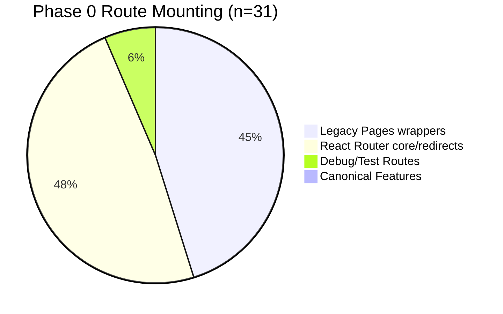
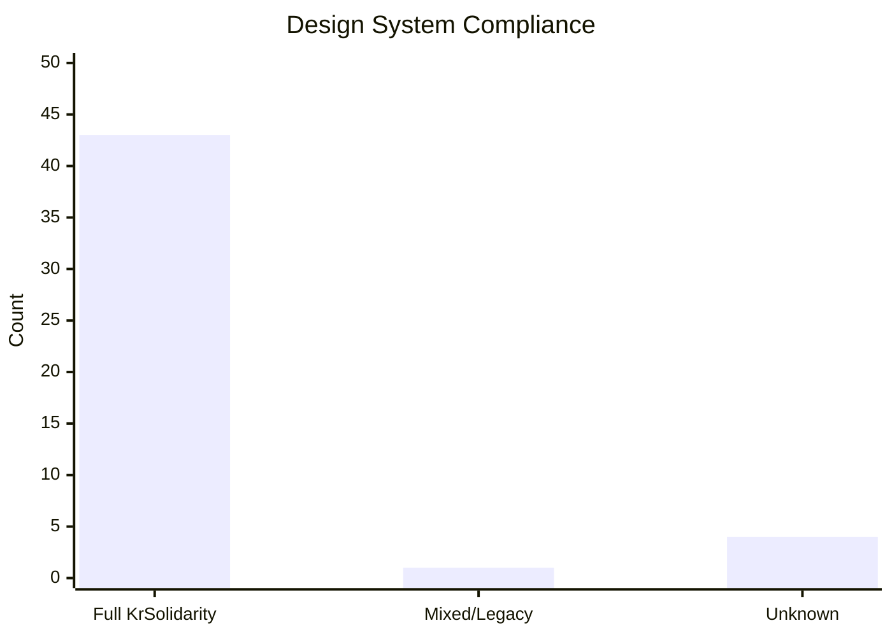

# Phase 0 Analysis Summary: Frontend Consolidation Baseline
*Baseline Extraction Date: 2026-03-31*

## Objective
To establish a canonical baseline of the CareerCopilot frontend structure, identifying the gap between the current "drifting" state (legacy `pages/` wrappers) and the target "Solidarity" state (canonical `features/` ownership).

---

## 1. Routing & Authority Analysis
The analysis of `App.tsx` and the `route-registry.ts` reveals a significant reliance on legacy wrapper components.

### Route Ownership Distribution

> [!IMPORTANT]
> **Observation**: Exactly 0 canonical product routes are currently mounted directly from `features/`. This confirms 100% routing debt for the PR126 consolidation target.

---

## 2. Structural Drift & Orphans
The "Tri-Layered Truth" scan identifies existing codebases that are not yet wired into the runtime router.

| Asset Class | Count | Status |
| :--- | :--- | :--- |
| **Orphaned Features** | 13 | Exists in `/features` but un-routed. |
| **Orphaned Screens** | 12 | Exists in `/screens` but un-routed. |
| **Non-Feature Routes** | 31 | Mounted in `App.tsx` via `/pages` or redirects. |

**Critical Orphans identified for Phase 3 Quarantine:**
- `AnimationTest.tsx` (Un-routed page)
- Legacy support for `/tracker`, `/kanban`, `/ingestion` (Handled by redirects).

---

## 3. Component Integrity & Design Compliance
AST-powered inventory of 48 components.

### KR Solidarity Adoption

- **Compliance Score**: **89.6%**
- **Token Health**: 43/48 components are strictly using the kebab-case `--kr-` token set.
- **Top 3 Structural Anchors**:
  1. `Placard` (14 usages) - High-fidelity layout container.
  2. `Strike` (12 usages) - Primary action archetype.
  3. `LayeredHero` (9 usages) - Visual entry point.

---

## 4. Key Recommendations for Phase 1
Based on this analysis, the primary focus for the first migration batch is **Remounting Authority**:
- **Pivot**: Move the 14 routes in `App.tsx` from `./pages/*` to their orphaned counterparts in `./features/*`.
- **Hardening**: Refactor `DocumentWorkbench` and `ApplicationFinalization` to adopt missing KrSolidarity tokens found during the AST scan.
- **Cleanup**: Target the 13 orphaned feature folders for immediate "Wiring-in" to prevent duplicate logic creation.
