# Figma Routes Dev Map

```mermaid
flowchart TD
    root["App Router"]

    subgraph public["Public / Internal"]
        landing["/ (LandingPage)"]
        auth["/auth (AuthPage)"]
        login["/login -> /auth"]
        register["/register -> /auth"]
        styleguide["/style-guide (StyleGuide)"]
        sidekick["/design-sidekick (DesignSidekick)"]
        anim["/animation-test (AnimationTestPage)"]
    end

    subgraph migrated["MigratedRouteLayout — Main App"]
        dashboard["/dashboard (Dashboard)"]
        opportunities["/opportunities (Opportunities)"]
        applications["/applications (ApplicationTracker)"]
        profile["/profile (ProfilePage)"]
        analysis["/analysis (AnalysisPage)"]
        docs["/documents (DocsPage)"]
        apply["/apply (ApplyQuick)"]
        generation["/generation (TabbedGenerationPanel)"]
        settings["/settings (Settings)"]
        onboarding["/onboarding (OnboardingPage)"]
    end

    subgraph support["ProtectedLayout — Support Only"]
        assetlib["/asset-library (AssetLibrary)"]
        tokentest["/test-tokens (TokenTest)"]
    end

    subgraph nav["Primary Sidebar Nav"]
        navdash["Dashboard"]
        navopp["Opportunities"]
        navapps["Applications"]
        navprofile["Profile"]
        navanalysis["ATS Scoring"]
        navdocs["My Docs"]
    end

    subgraph deprecated["Deprecated Labels / Old Route Names"]
        tracker["/tracker"]
        kanban["/kanban"]
        lookout["/lookout"]
        feed["/feed"]
        identity["/identity"]
        dossier["/dossier"]
        ingestion["/ingestion"]
        careeringest["/career/ingest"]
        applyquick["/apply/quick"]
        ksc["/ksc-generator"]
        cover["/cover-letter-generator"]
        studio["/studio"]
        docsalias["/docs"]
        editor["/editor"]
        jobqueue["/job-queue"]
        dashoverview["/dashboard-overview"]
        welcome["/welcome"]
    end

    root --> public
    root --> migrated
    root --> support
    migrated --> nav

    navdash --> dashboard
    navopp --> opportunities
    navapps --> applications
    navprofile --> profile
    navanalysis --> analysis
    navdocs --> docs

    tracker --> applications
    kanban --> applications
    lookout --> opportunities
    feed --> opportunities
    identity --> profile
    dossier --> profile
    ingestion --> profile
    careeringest --> profile
    applyquick --> apply
    ksc --> generation
    cover --> generation
    studio --> generation
    docsalias --> docs
    editor --> docs
    jobqueue --> dashboard
    dashoverview --> dashboard
    welcome --> onboarding
```

- Main app layout: `MigratedRouteLayout` owns the product destinations; `ProtectedLayout` is only for support surfaces.
- Canonical docs route: `/documents`; `/docs` is only a compatibility alias that should redirect silently to `/documents`.
- Generation destination: `/generation` should absorb the old KSC and cover-letter flows in one tabbed workspace.
- Primary nav: `Dashboard`, `Opportunities`, `Applications`, `Profile`, `ATS Scoring`, `My Docs`.
- Reorganization rule for Figma: keep all existing content, but move old labels and flows under these destinations instead of deleting them.
